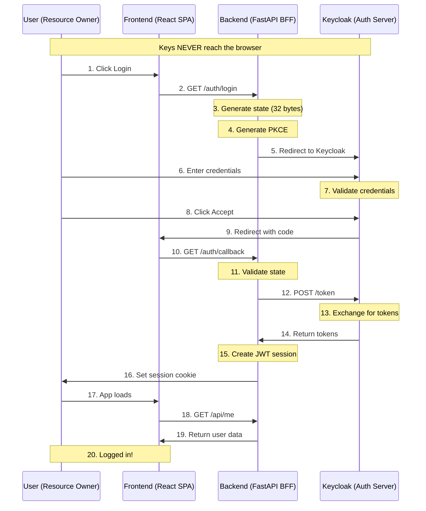
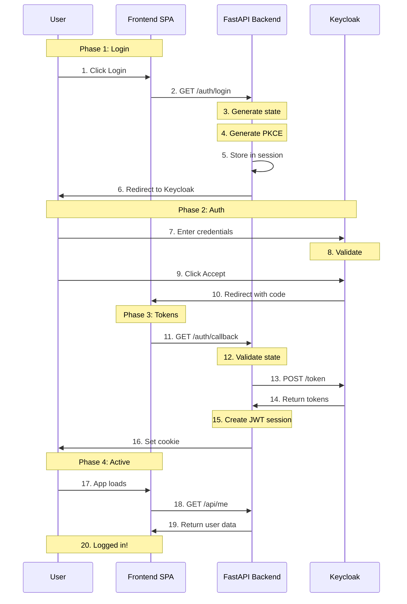
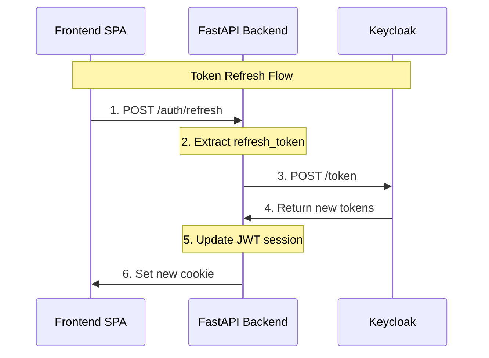
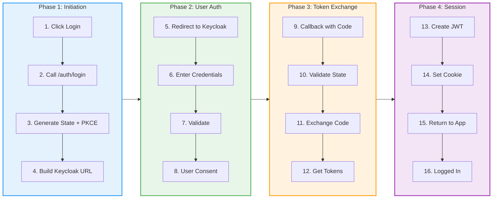

# OAuth 2.0 Authentication Flow - Technical Documentation

## Overview

This document describes the complete OAuth 2.0 authentication flow implemented in our application. We use the **Authorization Code Flow with PKCE** (Proof Key for Code Exchange) combined with a **Backend-for-Frontend (BFF)** pattern.

This is the recommended approach for browser-based applications as per [OAuth 2.0 Security Best Current Practice (RFC 9700)](https://datatracker.ietf.org/doc/html/rfc9700).

## Glossary - What Do All These Terms Mean?

### OAuth 2.0
A standard for giving one app permission to access your account in another app. Like when you click "Login with Google" - Google checks your password, then gives the app access to your info.

### Authorization Code Flow
The safe way to log in using OAuth. Instead of sending your password to the app, you log in at Google (or Keycloak), and Google gives a temporary code. The app exchanges this code for a token.

### PKCE (Pronounced "pixy")
**Proof Key for Code Exchange** - A security step that makes sure no one can steal your login code.

Think of it like this:
- You generate a secret password (code_verifier) on your server
- You send a "fingerprint" of that password (code_challenge) to Keycloak
- Only the server that created the secret can use the code
- If someone steals the code, they can't use it without the secret

### BFF (Backend for Frontend)
A server that sits between your website and other services. It handles all the complex auth work so your frontend doesn't have to.

### Access Token
A digital key that lets you use an API for a short time (usually 5 minutes). Like a temporary ID badge.

### Refresh Token
A digital key that lets you get a new access token when the old one expires. Like a badge that gets you a new temporary ID badge.

### ID Token
Proof that proves who you are. Contains your user info like name and email.

### JWT (JSON Web Token)
A special string that safely carries your info. It's like a laminated ID card - it has your info inside, and it's signed so it can't be forged.

### Session Token
Our own token that wraps all the important info together. We create this to manage your login easily.

### HttpOnly Cookie
A special cookie that JavaScript cannot read. This protects against hackers stealing your login.

### SameSite Cookie
A setting that prevents other websites from using your cookie. Like a name tag that only works at one party.

### State Parameter
A random string that prevents CSRF attacks. It makes sure the login request came from your app, not a hacker's site.

### Client ID / Client Secret
A username and password for your app to identify itself to Keycloak. Like registering your app with Google.

### Confidential Client
An app that can keep secrets. Our backend is this type - it stores the client_secret safely.

### Public Client
An app that cannot keep secrets. Browser apps are this type - the code is visible to everyone.

### Authorization Code
A temporary ticket (like a movie ticket) that proves Keycloak said "yes". You give this code to the backend to get your real token.

### Token Exchange
The moment when the backend gives the authorization code to Keycloak and gets back real tokens.

---

## Who's Involved? (The Players)

Here's who does what:

| Who | Role | What they do |
|-----|------|------------|
| You | User | Click login, type password |
| Frontend | Website | Shows buttons and pages |
| Backend | API Server | Handles all the auth logic |
| Keycloak | Identity Server | Checks your password |

Think of it like a bank:
- **You** = Customer
- **Frontend** = The bank lobby (what you see)
- **Backend** = The bank teller (does the work)
- **Keycloak** = The vault (keeps the passwords)

---

## Architecture - System Overview



### Why This Architecture?

| Traditional (Insecure) | Our Architecture (Secure) |
|------------------------|----------------------|
| User -> Keycloak (direct) | User -> Backend -> Keycloak |
| Tokens in localStorage | Tokens in server session |
| Browser sees all tokens | Browser sees only cookie |
| XSS = token theft | HttpOnly blocks XSS |

## Why This Approach?

### Problems with Traditional Flow (Direct SPA to Keycloak)

1. **Token exposure**: Tokens stored in localStorage are vulnerable to XSS attacks
2. **No refresh tokens**: Browsers can't safely store refresh tokens
3. **Client secret exposure**: Can't use confidential clients in browser
4. **CSRF vulnerabilities**: Harder to protect against CSRF attacks

### Our Solution: BFF + PKCE

| Issue | Traditional | Our Solution |
|-------|-------------|-------------|
| Token storage | localStorage (browser) | Server-side session |
| Refresh token | Not supported | Server-side |
| Client type | Public client | Confidential client |
| Security | XSS vulnerable | HttpOnly cookie |
| PKCE | Optional | Required |

## The Parts of Our System

### 1. Frontend (The Website)

- Shows you the login button and pages
- When you click login, it asks the backend to help
- Never talks to Keycloak directly - too dangerous!
- Uses cookies to talk to the backend

### 2. Backend (The Middleman)

- The "BFF" - handles all the auth work
- Creates the login links, checks the codes
- Keeps your tokens safe on the server
- Sends you a simple cookie that the browser remembers

### 3. Keycloak (The Gatekeeper)

- Like Google login, but runs on your server
- Keeps the user list and passwords
- Asks for your password
- Gives out the temporary codes
- Sets HttpOnly secure cookies for frontend
- Validates sessions on each request

### 3. Keycloak (Authorization Server)

- Manages users and credentials
- Handles login and consent
- Issues authorization codes
- Exchanges codes for tokens
- Validates client credentials

## Detailed Flow

### Step 1: User Initiates Login

```
User ───▶ Frontend: Click "Login" button
```

The user clicks the login button in the frontend application.

---

### Step 2: Frontend Calls Backend Login Endpoint

```
Frontend ───▶ Backend: GET /auth/login
```

Frontend redirects the browser to the backend's `/auth/login` endpoint.

**Backend implementation:**
```python
@router.get("/login")
async def login(request: Request):
    state = generate_state()
    code_verifier, code_challenge = generate_pkce()
    
    request.session["oauth_state"] = state
    request.session["code_verifier"] = code_verifier
    
    # ... build Keycloak URL
```

---

### Step 3: Backend Generates State

The backend creates a random random string like:

```
state = "random-32-characters-like-A1b2c3..."
```

**Why is "state" needed? (Simple explanation)**

This prevents a trick called CSRF (Cross-Site Request Forgery).

Imagine:
- A bad website tricks you into clicking a hidden link
- That link tries to log into your account through Keycloak
- Keycloak sends the code back to your app
- Your app doesn't know if you started this or a hacker did

The state solves this:
- You create a random token and remember it
- When Keycloak redirects back, you check the token
- If the token doesn't match, you reject it
- Hackers can't guess your random token

---

### Step 4: Backend Generates PKCE

The backend creates two special random strings:

```
code_verifier = "random-32-char-string-like-this"
code_challenge = "base64-hash-of-that-string"
```

**Why is PKCE needed? (Simple explanation)**

Imagine you send a secret code through the mail. An thief could steal it and use it before you.

PKCE is like:
1. You create a secret password
2. You send only a "fingerprint" of that password (the challenge)
3. When you receive the code, you must prove you still have the password
4. The thief doesn't have your password, so they can't use the stolen code

**How it works:**

| Term | What it is | Why |
|-----|-----------|-----|
| code_verifier | A random secret password you create | Only your server knows this |
| code_challenge | A fingerprint of that password | Anyone can see this |
| S256 | The method to make the fingerprint | Hash the password with math |

**Simple flow:**
1. Your server creates a secret (code_verifier)
2. Your server creates a fingerprint of that secret (code_challenge)
3. You send the fingerprint to Keycloak
4. Later, when exchanging the code, you must prove you still have the secret
5. If you don't have the secret, the exchange fails

---

### Step 5: Backend Stores in Session

```
Session Storage:
├── oauth_state: "abcd..."
└── code_verifier: "xyz..."
```

Both values are stored in the server-side session (encrypted cookies).

**Why server-side storage:**
- Code verifier is secret and must not reach the browser
- Allows validation when code is exchanged

---

### Step 6: Backend Builds Keycloak URL

```
URL: {KEYCLOAK_URL}/realms/{REALM}/protocol/openid-connect/auth?
    client_id={CLIENT_ID}&
    redirect_uri={BACKEND_URL}/auth/callback&
    response_type=code&
    scope=openid+profile+email+offline_access&
    state={STATE}&
    code_challenge={CODE_CHALLENGE}&
    code_challenge_method=S256
```

**Parameters in the URL (explained simply):**

| Parameter | What it means | Simple explanation |
|-----------|--------------|-----------------|
| client_id | "notes-app-client" | "This is my app" - identifies your app |
| redirect_uri | "/auth/callback" | "Send code here" - where to send the user back |
| response_type | "code" | "Give me a code" - not the token directly |
| scope | "openid profile email offline_access" | "What I want access to" - permissions |
| state | "random-string" | "I started this" - proves it was you |
| code_challenge | "hash-of-secret" | "My fingerprint" - PKCE proof |
| code_challenge_method | "S256" | "How I made the fingerprint" - the method |

**What do all those "scope" words mean?**

| Scope | What it gives access to |
|-------|---------------------|
| openid | Your identity (who you are) |
| profile | Your name, picture, etc. |
| email | Your email address |
| offline_access | Keep you logged in for a long time |

---

### Step 7: Backend Redirects to Keycloak

```
Backend ───▶ Frontend ───▶ Keycloak: 302 Redirect
```

The backend returns a `302 Found` redirect response to the browser, pointing to Keycloak's authorization endpoint.

**HTTP Response:**
```http
HTTP/1.1 302 Found
Location: https://keycloak.../auth?client_id=...
```

The browser automatically follows the redirect.

---

### Step 8: User Sees Keycloak Login Page

```
Browser ───▶ Keycloak: Display login form
```

The browser shows Keycloak's login page.

---

### Step 9: User Enters Credentials

```
User ───▶ Keycloak: Enter username and password
```

User enters their credentials on Keycloak's hosted login page.

---

### Step 10: Keycloak Validates Credentials

```
Keycloak: Validate username + password
```

Keycloak checks the credentials against its user database.

---

### Step 11: User Approves (Consent)

```
Keycloak: Show consent screen (optional)
```

If the client requires any sensitive scopes, Keycloak shows a consent screen where the user must approve access.

---

### Step 12: Keycloak Redirects Back with Code

```
Keycloak ───▶ Frontend ───▶ Backend: 
    /auth/callback?code={AUTHORIZATION_CODE}&state={STATE}
```

Keycloak redirects back to our redirect_uri with:
- `code` - The authorization code
- `state` - Must match what we sent (validates nothing was tampered)

---

### Step 13: Backend Validates State

```
Backend: session["oauth_state"] == state
```

The backend verifies the state parameter matches what was stored in the session. If not, the request is rejected.

---

### Step 14: Backend Removes Code Verifier

```
Backend: code_verifier = session.pop("code_verifier")
```

The code verifier is retrieved from the session and removed. It can only be used once.

---

### Step 15: Backend Exchanges Code for Tokens

```
Backend ───▶ Keycloak: POST /token
```

The backend sends a token request to Keycloak:

```http
POST {KEYCLOAK_URL}/realms/{REALM}/protocol/openid-connect/token
Content-Type: application/x-www-form-urlencoded

grant_type=authorization_code
&client_id={CLIENT_ID}
&client_secret={CLIENT_SECRET}
&code={AUTHORIZATION_CODE}
&redirect_uri={BACKEND_URL}/auth/callback
&code_verifier={CODE_VERIFIER}
```

**Note:** This request is made server-to-server. The client_secret never reaches the browser.

---

### Step 16: Keycloak Returns Tokens

Keycloak gives back these tokens:

```json
{
    "access_token": "eyJhbGc...",
    "refresh_token": "eyJhbGc...",
    "id_token": "eyJhbGc...",
    "token_type": "Bearer",
    "expires_in": 300,
    "refresh_expires_in": 1800
}
```

**What each token means:**

| Token | Like a... | What it does |
|-------|-----------|------------|
| access_token | Temporary ID badge | Lets you use the app for 5 minutes |
| refresh_token | Badge renewer card | Gets you a new ID badge when it expires |
| id_token | Your ID card | Shows who you are (name, email, etc.) |

---

### Step 17: Backend Creates Session Token

```
Backend: Create JWT session token
```

The backend creates a signed JWT containing:

```python
payload = {
    "sub": "user-id",
    "username": "john",
    "email": "john@example.com",
    "roles": ["editor"],
    "kc_refresh_token": "eyJhbGc...",  # For token refresh
    "exp": 1234567890
}
```

**Why wrap tokens in JWT:**
- Single secure cookie instead of multiple tokens
- Session data readable by backend
- Automatic expiration handling

---

### Step 18: Backend Sets Session Cookie

```
Backend ───▶ Frontend: Set-Cookie: session_token={JWT}
```

The backend sets a special cookie with security features:

```http
Set-Cookie: session_token=JWT; HttpOnly; Secure; SameSite=lax
```

**What all those settings mean:**

| Setting | What it does | Why it matters |
|--------|-------------|---------------|
| HttpOnly | JavaScript can't read this | Stops hackers from stealing your token |
| Secure | Only sent over HTTPS | Stops someone from intercepting it |
| SameSite=lax | Only works on your site | Stops other sites from using it |
| Path=/ | Works on all pages | Your whole app is logged in |
| Max-Age=86400 | Lasts 24 hours | You stay logged in for a day |

---

### Step 19: Backend Redirects to Frontend

```
Backend ───▶ Frontend: /callback
```

The backend redirects the browser to the frontend's callback page.

---

### Step 20: Frontend Loads Authenticated View

```
Frontend: Display authenticated interface
```

The frontend recognizes the user is logged in and displays the authenticated view.

---

### Step 21: Frontend Calls User Endpoint

```
Frontend ───▶ Backend: GET /api/me (with cookie)
```

Frontend tries to fetch user data using the session cookie.

---

### Step 22: Backend Returns User Data

```
Backend ───▶ Frontend: User profile
```

```json
{
    "sub": "user-id",
    "username": "john",
    "email": "john@example.com",
    "roles": ["editor"]
}
```

---

## Token Refresh Flow

When the access token expires:

```
Frontend ───▶ Backend: POST /auth/refresh
    (with session_token cookie)

Backend ───▶ Keycloak: POST /token
    grant_type=refresh_token
    &refresh_token={KC_REFRESH_TOKEN}

Keycloak ───▶ Backend: New tokens

Backend ───▶ Frontend: New session_token cookie
```

**Flow explained:**

1. Frontend calls `/auth/refresh` with session cookie
2. Backend extracts refresh_token from JWT
3. Backend sends refresh_token to Keycloak
4. Keycloak returns new tokens
5. Backend creates new session JWT
6. Frontend receives new session cookie

---

## Mermaid Diagram - Full Auth Flow



---

## Token Refresh Flow - Mermaid Diagram



---

## Visual Flow Summary



---

## Code Reference

| File | Description |
|------|------------|
| `apps/backend/app/routes/auth.py` | OAuth 2.0 endpoints |
| `apps/backend/app/auth/service.py` | Session token creation |
| `apps/frontend/src/services/auth.js` | Frontend auth functions |

### Key Functions from auth.py

```python
def generate_state() -> str:
    return secrets.token_urlsafe(32)


def generate_pkce() -> tuple[str, str]:
    code_verifier = secrets.token_urlsafe(32)
    digest = hashlib.sha256(code_verifier.encode()).digest()
    code_challenge = base64.urlsafe_b64encode(digest).decode().rstrip("=")
    return code_verifier, code_challenge
```

---

## Security - What Are We Protecting Against?

| Threat | What it is | How we stop it |
|--------|-----------|--------------|
| XSS | Hacker steals your token from localStorage | HttpOnly cookie - JavaScript can't read it |
| CSRF | Hacker tricks your browser into calling our app | SameSite cookie + state parameter |
| Code theft | Hacker steals the login code | PKCE - requires the secret to use code |
| Token replay | Hacker tries to reuse an old token | Code expires quickly (5 minutes) |
| Cookie theft | Hacker steals your cookie | HttpOnly + Secure (HTTPS only) |

## Security Best Practices We Follow

1. PKCE is always used - makes the login code useless without the secret
2. Client secret stays on server - never exposed to the browser
3. Tokens stay on server - never in localStorage
4. HttpOnly cookies - JavaScript can't read them
5. Secure cookies - only sent over HTTPS (encrypted)
6. SameSite=lax - other sites can't use your cookie
7. State parameter - proves you started the login request
8. Short access token - expires in 5 minutes
9. Refresh token - lets you stay logged in without logging in again

---

## Related RFCs

- [RFC 6749](https://datatracker.ietf.org/doc/html/rfc6749) - OAuth 2.0 Authorization Framework
- [RFC 7636](https://datatracker.ietf.org/doc/html/rfc7636) - PKCE Extension
- [RFC 6750](https://datatracker.ietf.org/doc/html/rfc6750) - Bearer Token Usage
- [RFC 9700](https://datatracker.ietf.org/doc/html/rfc9700) - OAuth 2.0 Security Best Current Practice