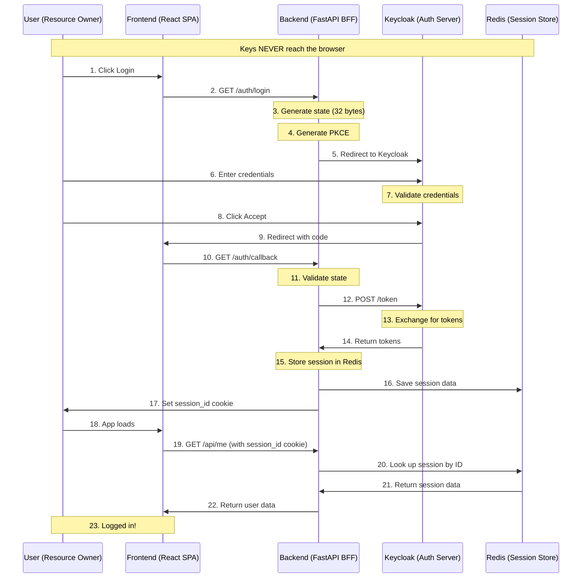
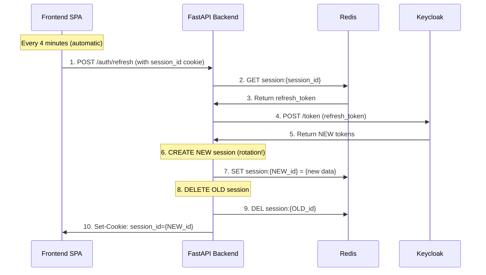
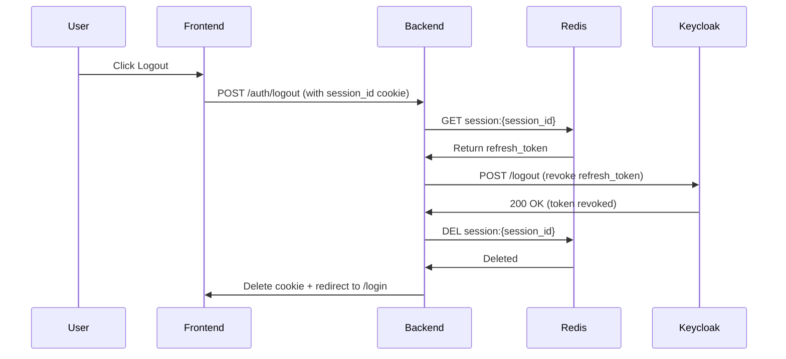
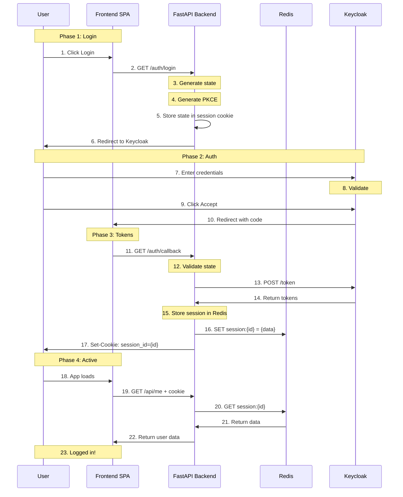

# OAuth 2.0 Authentication Flow - Technical Documentation

## Overview

This document describes the complete OAuth 2.0 authentication flow implemented in our application. We use the **Authorization Code Flow with PKCE** (Proof Key for Code Exchange) combined with a **Backend-for-Frontend (BFF)** pattern with **Redis-based session management**.

This is the recommended approach for browser-based applications as per [OAuth 2.0 Security Best Current Practice (RFC 9700)](https://datatracker.ietf.org/doc/html/rfc9700).

## Glossary - What Do All These Terms Mean?

### OAuth 2.0
A standard for giving one app permission to access your account in another app. Like when you click "Login with Google" - Google checks your password, then gives the app access to your info.

### Authorization Code Flow
The safe way to log in using OAuth. Instead of sending your password to the app, you log in at Google (or Keycloak), and Google gives a temporary code. The app exchanges this code for a token.

### PKCE (Pronounced "pixy")
**Proof Key for Code Exchange** - A security step that makes sure no one can steal your login code.

Think of it like this:
- You generate a secret password (code_verifier) on your server
- You send a "fingerprint" of that password (code_challenge) to Keycloak
- Only the server that created the secret can use the code
- If someone steals the code, they can't use it without the secret

### BFF (Backend for Frontend)
A server that sits between your website and other services. It handles all the complex auth work so your frontend doesn't have to.

### Redis
A fast in-memory database. We store user sessions here instead of in the cookie. Like a locker system - the cookie is just a key (locker number), and the actual user info is inside the locker (Redis).

### Session ID
A random string stored in a cookie. This is NOT the user data - it's just a key that lets the backend find the user data in Redis.

### Access Token
A digital key that lets you use an API for a short time (usually 5 minutes). Like a temporary ID badge.

### Refresh Token
A digital key that lets you get a new access token when the old one expires. Like a badge that gets you a new temporary ID badge.

### JWT (JSON Web Token)
A special string that safely carries your info. It's like a laminated ID card - it has your info inside, and it's signed so it can't be forged.

### HttpOnly Cookie
A special cookie that JavaScript cannot read. This protects against hackers stealing your login.

### SameSite Cookie
A setting that prevents other websites from using your cookie. Like a name tag that only works at one party.

### State Parameter
A random string that prevents CSRF attacks. It makes sure the login request came from your app, not a hacker's site.

### Client ID / Client Secret
A username and password for your app to identify itself to Keycloak. Like registering your app with Google.

---

## Who's Involved? (The Players)

Here's who does what:

| Who | Role | What they do |
|-----|------|------------|
| You | User | Click login, type password |
| Frontend | Website | Shows buttons and pages |
| Backend | API Server | Handles all the auth logic |
| Keycloak | Identity Server | Checks your password |
| Redis | Session Store | Stores user sessions |

Think of it like a hotel:
- **You** = Guest
- **Frontend** = Hotel lobby (what you see)
- **Backend** = Reception desk (does the work)
- **Keycloak** = ID verification (checks your identity)
- **Redis** = Hotel key cards (stores your room access)

---

## Architecture - System Overview



### Why This Architecture?

| Traditional (Insecure) | Our Architecture (Secure) |
|------------------------|----------------------|
| User -> Keycloak (direct) | User -> Backend -> Keycloak |
| Tokens in localStorage | Tokens in Redis server |
| Browser sees all tokens | Browser sees only session_id |
| XSS = token theft | HttpOnly blocks XSS |

---

## Why Redis for Sessions?

### Old Way (JWT in Cookie - No Redis)
```
Cookie: session_token = JWT{user_data + refresh_token}
```

**Problems:**
- Can't logout user instantly (token works until it expires)
- Can't see how many users are logged in
- Can't track or manage sessions
- If token is stolen, it's valid for days

### New Way (Redis Sessions)
```
Cookie: session_id = "random_string_123"
Redis:  session:random_string_123 = {user_data, refresh_token}
```

**Benefits:**
- ✅ Instant logout - just delete from Redis
- ✅ See active users - count Redis keys
- ✅ Track sessions per user
- ✅ Extend/shorten sessions anytime
- ✅ If cookie stolen, attacker needs Redis to get data (much harder)

---

## Detailed Flow

### Step 1: User Initiates Login

```
User ───▶ Frontend: Click "Login" button
```

The user clicks the login button in the frontend application.

---

### Step 2: Frontend Calls Backend Login Endpoint

```
Frontend ───▶ Backend: GET /auth/login
```

Frontend redirects the browser to the backend's `/auth/login` endpoint.

**Backend implementation:**
```python
@router.get("/login")
async def login(request: Request):
    state = generate_state()
    code_verifier, code_challenge = generate_pkce()
    
    request.session["oauth_state"] = state
    request.session["code_verifier"] = code_verifier
    
    # ... build Keycloak URL
```

---

### Step 3: Backend Generates State

The backend creates a random random string like:

```
state = "random-32-characters-like-A1b2c3..."
```

**Why is "state" needed?**

This prevents a trick called CSRF (Cross-Site Request Forgery).

Imagine:
- A bad website tricks you into clicking a hidden link
- That link tries to log into your account through Keycloak
- Keycloak sends the code back to your app
- Your app doesn't know if you started this or a hacker did

The state solves this:
- You create a random token and remember it
- When Keycloak redirects back, you check the token
- If the token doesn't match, you reject it
- Hackers can't guess your random token

---

### Step 4: Backend Generates PKCE

The backend creates two special random strings:

```
code_verifier = "random-32-char-string-like-this"
code_challenge = "base64-hash-of-that-string"
```

**Why is PKCE needed?**

Imagine you send a secret code through the mail. An thief could steal it and use it before you.

PKCE is like:
1. You create a secret password
2. You send only a "fingerprint" of that password (the challenge)
3. When you receive the code, you must prove you still have the password
4. The thief doesn't have your password, so they can't use the stolen code

---

### Step 5: Backend Stores in Session

```
Session Storage (encrypted cookie):
├── oauth_state: "abcd..."
└── code_verifier: "xyz..."
```

Both values are stored in the server-side session (encrypted cookies). These are only needed during login.

---

### Step 6: Backend Builds Keycloak URL

```
URL: {KEYCLOAK_URL}/realms/{REALM}/protocol/openid-connect/auth?
    client_id={CLIENT_ID}&
    redirect_uri={BACKEND_URL}/auth/callback&
    response_type=code&
    scope=openid+profile+email+offline_access&
    state={STATE}&
    code_challenge={CODE_CHALLENGE}&
    code_challenge_method=S256
```

---

### Step 7: Backend Redirects to Keycloak

```
Backend ───▶ Frontend ───▶ Keycloak: 302 Redirect
```

The backend returns a `302 Found` redirect response to the browser, pointing to Keycloak's authorization endpoint.

---

### Step 8: User Sees Keycloak Login Page

The browser shows Keycloak's login page.

---

### Step 9: User Enters Credentials

```
User ───▶ Keycloak: Enter username and password
```

User enters their credentials on Keycloak's hosted login page.

---

### Step 10: Keycloak Validates Credentials

Keycloak checks the credentials against its user database.

---

### Step 11: Keycloak Redirects Back with Code

```
Keycloak ───▶ Frontend ───▶ Backend: 
    /auth/callback?code={AUTHORIZATION_CODE}&state={STATE}
```

Keycloak redirects back to our redirect_uri with:
- `code` - The authorization code
- `state` - Must match what we sent (validates nothing was tampered)

---

### Step 12: Backend Validates State

```
Backend: session["oauth_state"] == state
```

The backend verifies the state parameter matches what was stored in the session. If not, the request is rejected.

---

### Step 13: Backend Exchanges Code for Tokens

```
Backend ───▶ Keycloak: POST /token
```

The backend sends a token request to Keycloak:

```http
POST {KEYCLOAK_URL}/realms/{REALM}/protocol/openid-connect/token
Content-Type: application/x-www-form-urlencoded

grant_type=authorization_code
&client_id={CLIENT_ID}
&client_secret={CLIENT_SECRET}
&code={AUTHORIZATION_CODE}
&redirect_uri={BACKEND_URL}/auth/callback
&code_verifier={CODE_VERIFIER}
```

---

### Step 14: Keycloak Returns Tokens

Keycloak gives back these tokens:

```json
{
    "access_token": "eyJhbGc...",
    "refresh_token": "eyJhbGc...",
    "id_token": "eyJhbGc...",
    "token_type": "Bearer",
    "expires_in": 300,
    "refresh_expires_in": 1800
}
```

| Token | Like a... | What it does |
|-------|-----------|------------|
| access_token | Temporary ID badge | Lets you use the app for 5 minutes |
| refresh_token | Badge renewer card | Gets you a new ID badge when it expires |
| id_token | Your ID card | Shows who you are (name, email, etc.) |

---

### Step 15: Backend Creates Redis Session

```
Backend ───▶ Redis: SET session:{session_id} = {user_data}
```

The backend stores session data in Redis:

```python
session_data = {
    "sub": "user-id",
    "username": "john",
    "email": "john@example.com",
    "roles": ["editor"],
    "kc_refresh_token": "eyJhbGc..."  # For token refresh
}

await redis.set(f"session:{session_id}", json.dumps(session_data), ex=86400)
```

**Why store in Redis:**
- Session data is separate from the cookie
- Can logout user instantly
- Can track active sessions
- Can extend/shorten sessions

---

### Step 16: Backend Sets Session ID Cookie

```
Backend ───▶ Frontend: Set-Cookie: session_id={RANDOM_STRING}
```

The backend sets a cookie with ONLY the session ID (not the actual data):

```http
Set-Cookie: session_id=CoFTXnDW9ta1Yayx6UnyA21gnB46Tpowb7; HttpOnly; Secure; SameSite=lax
```

**What the cookie contains:**
- Just a random string (like "CoFTXnDW9ta1Yayx6UnyA21gnB46Tpowb7")
- NOT the user data
- NOT the refresh token

This is much safer - even if someone steals the cookie, they can't use it without access to Redis.

---

### Step 17: Backend Redirects to Frontend

```
Backend ───▶ Frontend: /callback
```

The backend redirects the browser to the frontend's callback page.

---

### Step 18: Frontend Loads Authenticated View

The frontend recognizes the user is logged in and displays the authenticated view.

---

### Step 19: Frontend Calls User Endpoint

```
Frontend ───▶ Backend: GET /api/me (with session_id cookie)
```

Frontend tries to fetch user data using the session cookie.

---

### Step 20: Backend Looks Up Session in Redis

```
Backend ───▶ Redis: GET session:{session_id_from_cookie}
```

The backend uses the session_id from the cookie to look up data in Redis.

---

### Step 21: Redis Returns Session Data

```
Redis ───▶ Backend: {user_data, refresh_token}
```

Redis returns the stored session data.

---

### Step 22: Backend Returns User Data

```
Backend ───▶ Frontend: User profile
```

```json
{
    "sub": "user-id",
    "username": "john",
    "email": "john@example.com",
    "roles": ["editor"]
}
```

---

## Session Refresh Flow (With Session Rotation)

When the access token expires, the frontend automatically calls `/auth/refresh` every 4 minutes. This does TWO things:
1. Gets new Keycloak tokens
2. Rotates session ID for security



**Flow explained:**

1. Frontend calls `/auth/refresh` automatically every 4 minutes
2. Backend looks up session in Redis, gets refresh_token
3. Backend sends refresh_token to Keycloak
4. Keycloak returns new tokens
5. **Backend creates NEW session with new ID** (security!)
6. **Backend saves new session in Redis**
7. **Backend deletes OLD session from Redis** (rotation complete!)
8. Backend sets new cookie with new session_id

**Why Session Rotation?**
- If someone steals your cookie, they can only use it until next refresh
- After refresh, old cookie becomes useless (session deleted)
- Fresh session = fresh start = more secure

**Frontend Implementation:**
```javascript
useEffect(() => {
  if (!user) return;
  
  const REFRESH_INTERVAL = 4 * 60 * 1000;  // 4 minutes
  
  setInterval(async () => {
    await refreshSession();  // Creates new session + rotates
  }, REFRESH_INTERVAL);
}, [user]);
```

---

## Logout Flow



**What happens:**

1. User clicks logout
2. Backend gets session_id from cookie
3. Backend looks up refresh_token from Redis
4. Backend tells Keycloak to revoke the refresh_token
5. Backend deletes session from Redis (instant!)
6. Backend deletes the session_id cookie
7. User is redirected to login page

**Full logout** - user is logged out from BOTH:
- Our app (Redis + cookie deleted)
- Keycloak (refresh token revoked - must enter password again to login)

---

## Mermaid Diagram - Full Auth Flow



---

## Security - What Are We Protecting Against?

| Threat | What it is | How we stop it |
|--------|-----------|--------------|
| XSS | Hacker steals your token | HttpOnly cookie - JavaScript can't read it |
| CSRF | Hacker tricks your browser | SameSite cookie + state parameter |
| Code theft | Hacker steals the login code | PKCE - requires the secret to use code |
| Session hijacking | Hacker steals session_id | Session stored in Redis, not in cookie |
| Instant logout needed | User leaves device logged in | Delete from Redis, cookie becomes useless |

---

## Security Best Practices We Follow

1. **PKCE** - makes the login code useless without the secret
2. **Client secret stays on server** - never exposed to browser
3. **Keycloak tokens stay in Redis** - never in cookie or localStorage
4. **HttpOnly cookies** - JavaScript can't read them
5. **Secure cookies** - only sent over HTTPS (encrypted)
6. **SameSite=lax** - other sites can't use your cookie
7. **State parameter** - proves you started the login request
8. **Short access token** - expires in 5 minutes
9. **Redis sessions** - can instantly logout, track users
10. **session_id as key** - cookie is just a reference, not the data
11. **Session rotation on refresh** - new session ID every 4 minutes (prevents session fixation)
12. **Full logout** - revokes Keycloak token + deletes Redis session

---

## Code Reference

| File | Description |
|------|------------|
| `apps/backend/app/routes/auth.py` | OAuth 2.0 endpoints |
| `apps/backend/app/auth/redis_service.py` | Redis session operations |
| `apps/backend/app/auth/dependencies.py` | Session verification |
| `apps/frontend/src/services/auth.js` | Frontend auth functions |

### Key Redis Functions from redis_service.py

```python
async def create_session(user_data: dict, keycloak_refresh_token: str) -> str:
    """Create session in Redis, return session_id"""
    session_id = generate_session_id()
    session_data = {
        "sub": user_data.get("sub"),
        "username": user_data.get("username"),
        "email": user_data.get("email"),
        "roles": user_data.get("roles", []),
        "kc_refresh_token": keycloak_refresh_token
    }
    await redis.set(f"session:{session_id}", json.dumps(session_data), ex=86400)
    return session_id


async def get_session(session_id: str) -> Optional[dict]:
    """Get session data from Redis"""
    data = await redis.get(f"session:{session_id}")
    return json.loads(data) if data else None


async def delete_session(session_id: str) -> bool:
    """Delete session from Redis (logout)"""
    return await redis.delete(f"session:{session_id}") > 0
```

---

## Related RFCs

- [RFC 6749](https://datatracker.ietf.org/doc/html/rfc6749) - OAuth 2.0 Authorization Framework
- [RFC 7636](https://datatracker.ietf.org/doc/html/rfc7636) - PKCE Extension
- [RFC 6750](https://datatracker.ietf.org/doc/html/rfc6750) - Bearer Token Usage
- [RFC 9700](https://datatracker.ietf.org/doc/html/rfc9700) - OAuth 2.0 Security Best Current Practice