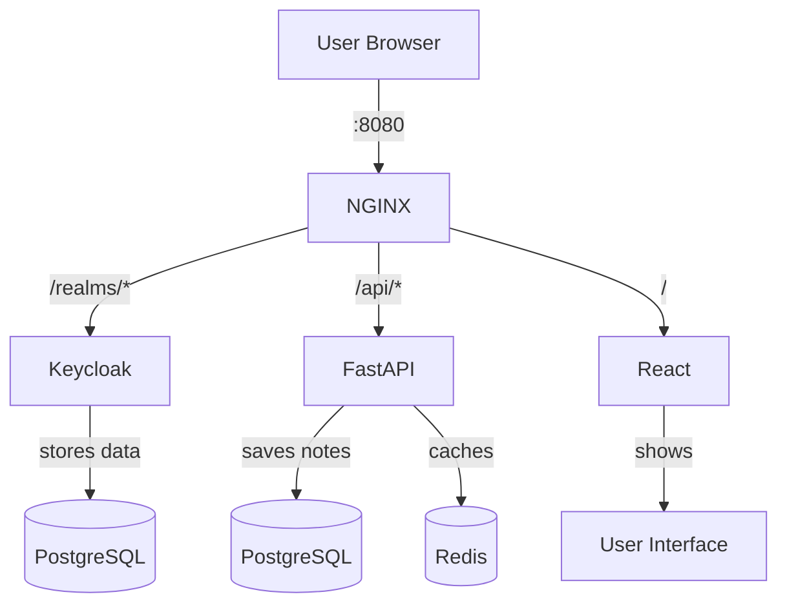
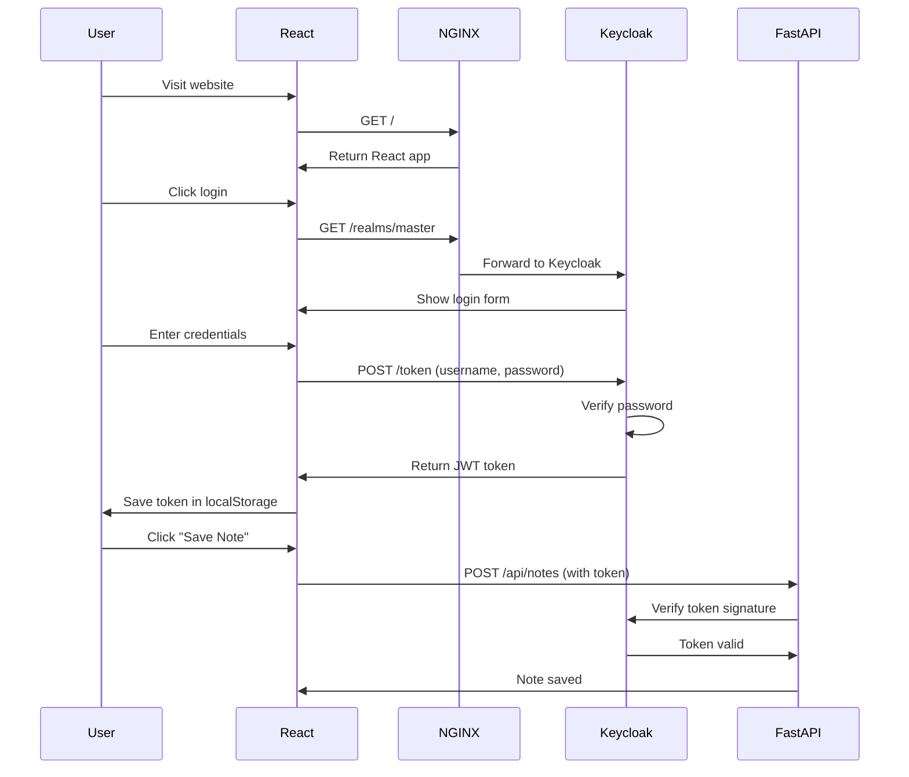
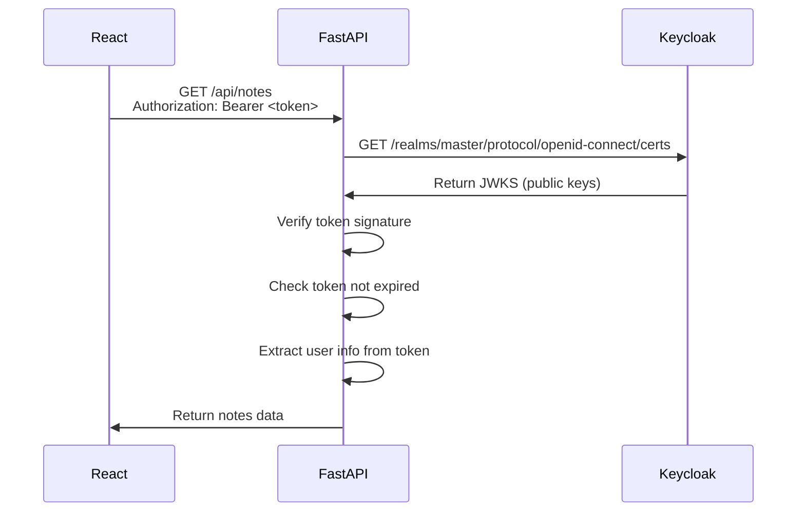
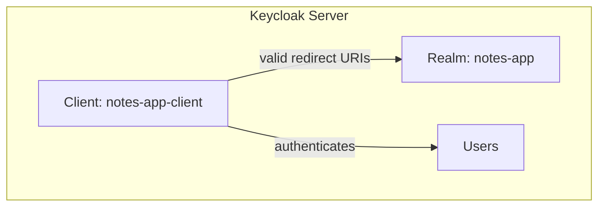
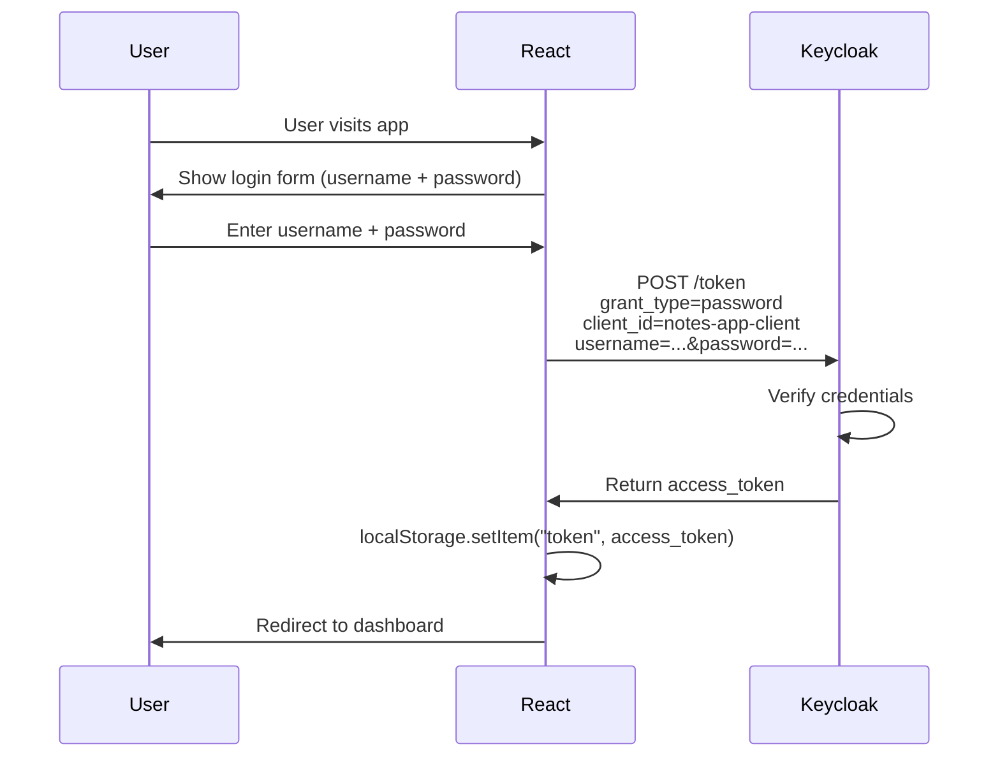
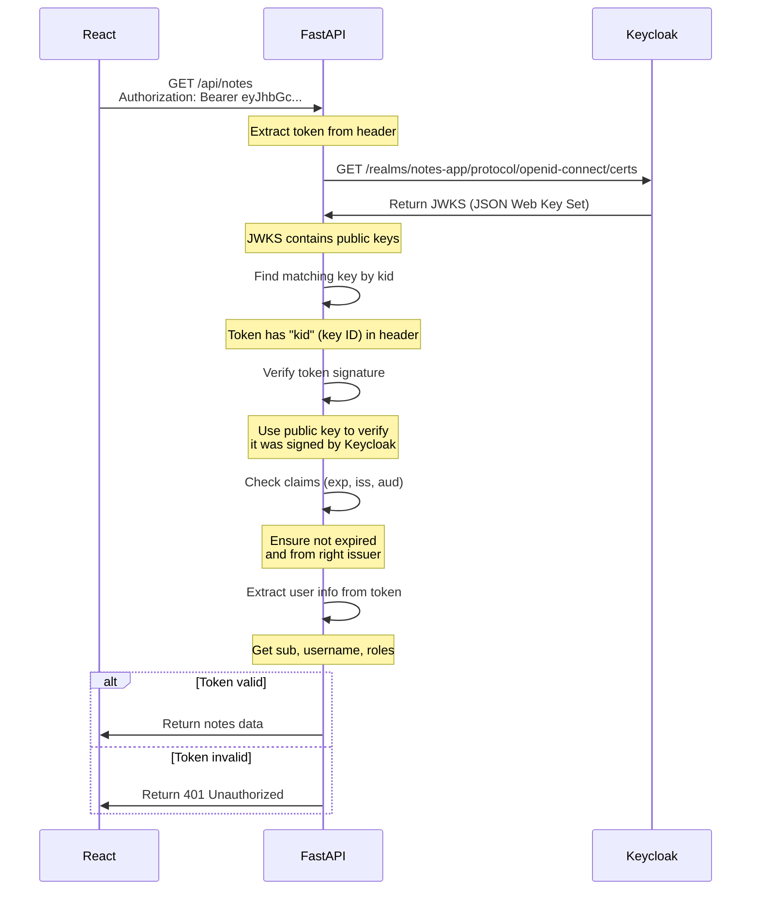
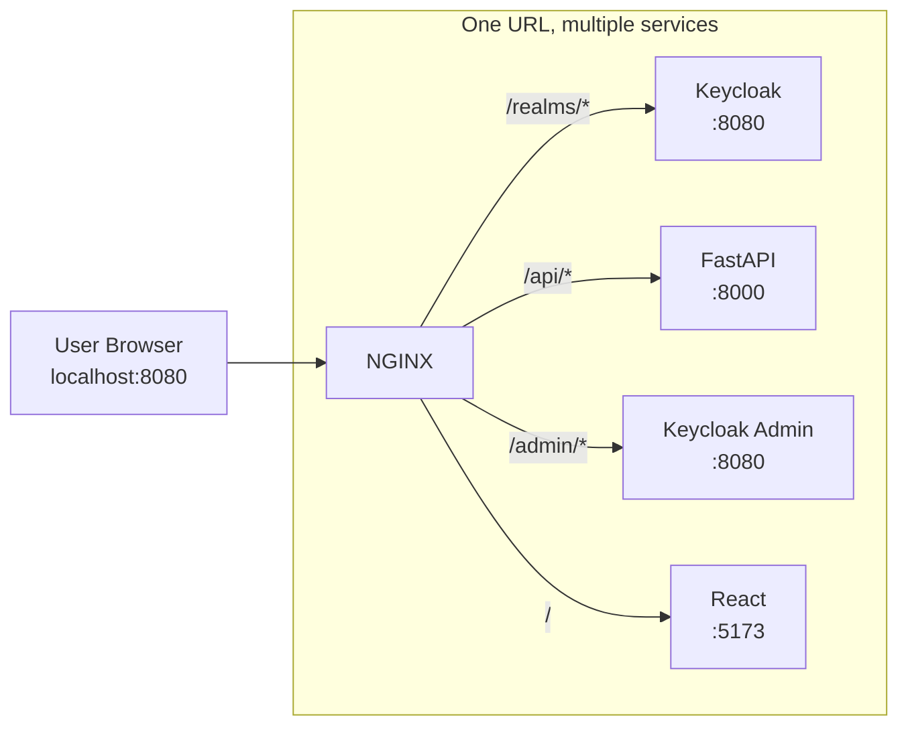
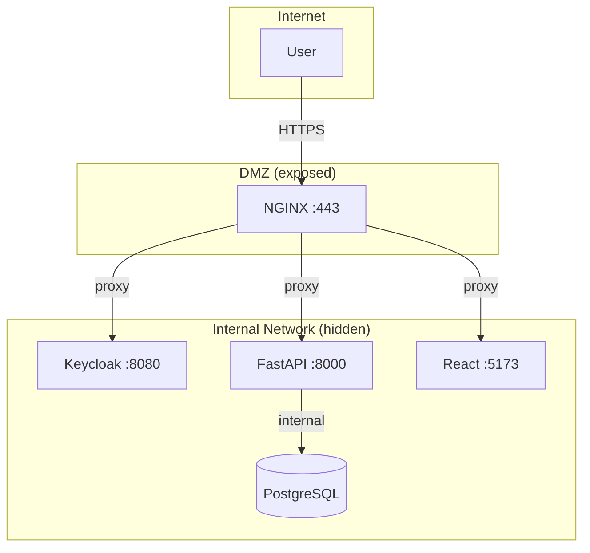
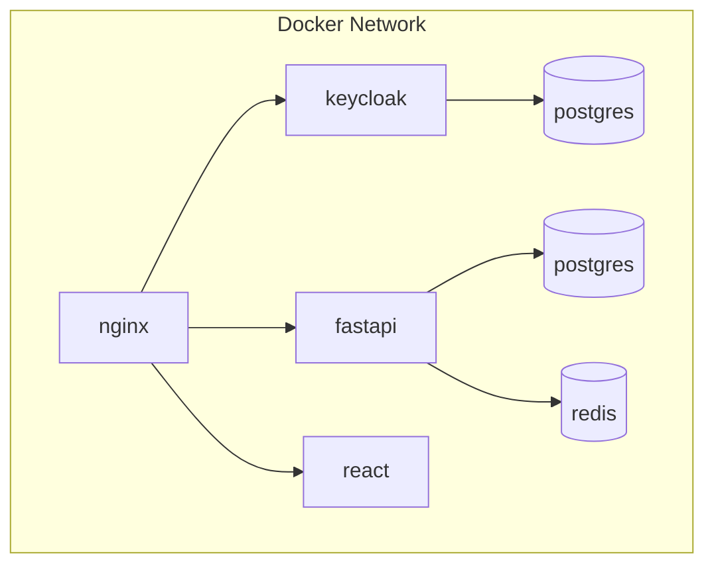

# Notes App - Technical Overview

A notes application with Keycloak authentication.

---

## Tech Stack

| Layer | Technology | Purpose |
|-------|------------|---------| 
| Frontend | React + Vite | User interface |
| Backend | FastAPI (Python) | REST API |
| Auth | Keycloak | Authentication |
| Database | PostgreSQL | Data storage |
| Cache | Redis | Caching |
| Proxy | NGINX | Traffic routing |

---

## Monorepo Structure

This project is a **monorepo** - all code is in one repository.

### What's a Monorepo?

**Monorepo = Single Repository**

Instead of:
- `frontend-repo/` - React app
- `backend-repo/` - Python API

We have:
- `apps/frontend/` - React app
- `apps/backend/` - Python API
- All in **one** repo

### Project Structure:

```
keycloack_learn/
├── apps/
│   ├── frontend/     ← React app (Node.js)
│   └── backend/       ← FastAPI (Python)
├── infra/            ← Docker configs
├── docs/             ← Documentation
├── package.json     ← pnpm workspace config
├── turbo.json       ← Turborepo config
└── pnpm-workspace.yaml
```

### Why Monorepo?

| Benefit | Explanation |
|---------|-------------|
| **One repo to clone** | `git clone` once, get everything |
| **Shared tooling** | One lint, one test config |
| **Cross-team** | Frontend and backend in one place |
| **Easy to run** | `pnpm dev` starts all services |
| **Consistency** | Same structure across projects |

### Tools Used:

- **pnpm workspaces** - Manages multiple packages
- **Turborepo** - Runs tasks across apps (parallel, caching)
- **Docker Compose** - Runs all services together

### Running the App:

```bash
# Start everything (all services)
pnpm dev

# Or start just one
pnpm dev:frontend  # Just frontend
pnpm dev:backend    # Just backend
```

### Login Credentials:

| Realm | Username | Password |
|-------|----------|----------|
| notes-app (app login) | `testuser` | `test123` |
| master (Keycloak admin) | `admin` | `admin` |

> **App Login**: Use `testuser` / `test123` to login to the Notes app
> **Keycloak Admin**: Use `admin` / `admin` at http://localhost:8080/admin

This is simpler than managing separate repos for frontend and backend.

---

## Architecture



### Request Flow:

| URL Path | Routes to | Purpose |
|---------|----------|---------|
| `/realms/*` | Keycloak | Login page |
| `/admin/*` | Keycloak | Admin console |
| `/api/*` | FastAPI | App API |
| `/` | React | Website |

---

## Authentication Flow



## Backend + Keycloak Integration

When FastAPI receives a request with a token, it must verify it's valid.



### Token Verification Steps:

1. **Extract token** from `Authorization: Bearer <token>` header
2. **Fetch JWKS** from Keycloak (`/realms/master/protocol/openid-connect/certs`)
3. **Find matching key** - token has a `kid` (key ID) that matches one in JWKS
4. **Verify signature** - use public key to verify token was signed by Keycloak
5. **Check claims** - verify `exp` (expiration) hasn't passed
6. **Extract claims** - get `sub`, `preferred_username`, `roles` from token
7. **Process request** - if valid, execute the API call

### Token Structure (JWT):

```json
{
  "sub": "user-123",
  "preferred_username": "john",
  "email": "john@example.com",
  "roles": ["user"],
  "exp": 1715623400,
  "iat": 1715620000,
  "iss": "http://localhost:8080/realms/master"
}
```

| Claim | Meaning |
|-------|---------|
| `sub` | User ID |
| `preferred_username` | Username |
| `roles` | User roles (for permissions) |
| `exp` | When token expires |
| `iss` | Who issued the token |

## Keycloak Client Configuration

Before React can authenticate, Keycloak needs to know about our app. This is done through a **Client** registration.

### Keycloak Setup:



### Client Settings in Keycloak (ROPC):

Current setup uses ROPC (Resource Owner Password Credentials):

| Setting | Value | Purpose |
|---------|-------|---------|
| Client ID | `notes-app-client` | Identifies our app |
| Client Protocol | `openid-connect` | OAuth2/OIDC standard |
| Access Type | `public` | No client secret needed |
| Standard Flow | Disabled | Not using redirects |
| Direct Access Grants | Enabled | Enable `password` grant |

---

## Migration Guide: ROPC to Authorization Code

This section shows how to migrate from ROPC (current) to Authorization Code flow (safer).

### What's Changing:

| Aspect | ROPC (Current) | Auth Code (New) |
|--------|---------------|-----------------|
| Login form | In your app | On Keycloak page |
| Client type | `public` | `confidential` |
| Client secret | None | Generate one |
| Standard flow | Disabled | Enabled |
| Direct grants | Enabled | Disabled |
| Security | Lower | Higher |

### Step 1: Update Keycloak Client Settings

In Keycloak Admin Console (`http://localhost:8080/admin`):

1. Go to **Clients** → Select `notes-app-client`
2. Change **Access Type** from `public` to `confidential`
3. A **Client Secret** will be generated (copy it)
4. **Standard Flow** → Enable (ON)
5. **Direct Access Grants** → Disable (OFF)
6. Add **Valid Redirect URIs**:
   ```
   http://localhost:5173/callback
   ```
7. **Web Origins**:
   ```
   http://localhost:5173
   ```
8. Click **Save**

### Step 2: Update Setup Script

File: `infra/setup-keycloak.sh` (line ~52)

**Current (ROPC):**
```json
"publicClient":true,
"standardFlowEnabled":false,
"directAccessGrantsEnabled":true
```

**New (Auth Code):**
```json
"publicClient":false,
"clientAuthenticatorType": "client-secret",
"clientSecret": "YOUR_GENERATED_SECRET",
"standardFlowEnabled":true,
"directAccessGrantsEnabled":false,
"redirectUris": [
  "http://localhost:5173/*",
  "http://localhost:5173/callback"
]
```

### Step 3: Update Frontend Login.jsx

File: `apps/frontend/src/pages/Login.jsx`

**Current (ROPC):**
```javascript
// Sends username/password directly to Keycloak
const response = await fetch('http://localhost:8080/realms/notes-app/protocol/openid-connect/token', {
  method: 'POST',
  body: new URLSearchParams({
    grant_type: 'password',
    client_id: 'notes-app-client',
    username,
    password,
  }),
});
```

**New (Authorization Code):**
```javascript
// Instead of form, just redirect to Keycloak
const keycloakUrl = `${KEYCLOAK_URL}/realms/${REALM}/protocol/openid-connect/auth
  ?client_id=${CLIENT_ID}
  &redirect_uri=${encodeURIComponent(CALLBACK_URL)}
  &response_type=code
  &scope=openid profile email`;

window.location.href = keycloakUrl;
```

### Step 4: Create Callback Page

File: `apps/frontend/src/pages/Callback.jsx` (already exists, update logic)

```javascript
// apps/frontend/src/pages/Callback.jsx

async function handleCallback() {
  // 1. Get code from URL
  const code = new URLSearchParams(window.location.search).get('code');
  
  if (!code) {
    window.location.href = '/login';
    return;
  }
  
  // 2. Exchange code for token
  const response = await fetch(
    'http://localhost:8080/realms/notes-app/protocol/openid-connect/token',
    {
      method: 'POST',
      headers: { 'Content-Type': 'application/x-www-form-urlencoded' },
      body: new URLSearchParams({
        grant_type: 'authorization_code',
        client_id: 'notes-app-client',
        client_secret: 'YOUR_CLIENT_SECRET',  // NEW
        code: code,
        redirect_uri: 'http://localhost:5173/callback',
      }),
    }
  );
  
  const tokens = await response.json();
  
  // 3. Save tokens
  localStorage.setItem('token', tokens.access_token);
  if (tokens.refresh_token) {
    localStorage.setItem('refresh_token', tokens.refresh_token);
  }
  
  // 4. Redirect to home
  window.location.href = '/';
}
```

### Step 5: Add Client Secret Config

File: `apps/frontend/src/services/auth.js`

```javascript
// Add client secret
export const keycloakConfig = {
  url: 'http://localhost:8080',
  realm: 'notes-app',
  clientId: 'notes-app-client',
  clientSecret: 'YOUR_CLIENT_SECRET',  // NEW: from Keycloak
  redirectUri: 'http://localhost:5173/callback',
};
```

### Step 6: Update API Service (Token Refresh)

File: `apps/frontend/src/services/auth.js`

The refresh token flow also changes:

```javascript
// ROPC: refresh with password grant
const params = new URLSearchParams({
  grant_type: 'refresh_token',
  client_id: 'notes-app-client',
  refresh_token: storedRefreshToken,
});

// Auth Code: refresh with client secret
const params = new URLSearchParams({
  grant_type: 'refresh_token',
  client_id: 'notes-app-client',
  client_secret: clientSecret,
  refresh_token: storedRefreshToken,
});
```

### Summary of Files to Change:

| File | What to Change |
|------|---------------|
| Keycloak Admin | Enable Standard Flow, add client secret |
| `infra/setup-keycloak.sh` | Update client config JSON |
| `apps/frontend/src/pages/Login.jsx` | Redirect to Keycloak instead of form |
| `apps/frontend/src/pages/Callback.jsx` | Exchange code for token |
| `apps/frontend/src/services/auth.js` | Add client secret, update refresh |

### React Configuration:

The frontend stores these settings:

```javascript
// apps/frontend/src/services/auth.js

export const keycloakConfig = {
  url: 'http://localhost:8080',        // Keycloak server
  realm: 'notes-app',                  // Realm name
  clientId: 'notes-app-client',        // Client ID in Keycloak
};

// Frontend runs on port 5173, but auth goes through NGINX at 8080
const redirectUri = 'http://localhost:5173/callback';
```

---

## Frontend Auth Flow

The app uses **ROPC** - let me explain what that means in simple words.

### What is ROPC?

**ROPC = Resource Owner Password Credentials**

In simple terms:

1. **Your app shows a login form** (username + password fields)
2. **User enters credentials** in your form
3. **Your app sends them directly** to Keycloak
4. **Keycloak returns a token**

```
User → Your Login Form → Keycloak → Token
```

That's it. Simple and straightforward.

### How ROPC Works (Simple Version):

| Step | What Happens |
|------|--------------|
| 1 | User sees your app's login form |
| 2 | User types username/password |
| 3 | Your app takes those and sends to Keycloak |
| 4 | Keycloak says "OK" and gives token |
| 5 | Your app saves the token |

**Think of it like**: A hotel guest gives their ID to the front desk → hotel verifies → gives room key.

---

### What is ROPC vs Authorization Code?

**ROPC (Your Current App):**
- Your app has its own login form
- User types in your form
- Your app sends password to Keycloak
- Your app gets the token

**Authorization Code (Safer):**
- User clicks login
- Your app redirects to Keycloak's page
- User types in Keycloak's form (NOT your app)
- Keycloak redirects back with a code
- Your app exchanges code for token
- Your app NEVER sees the password

Which is safer? **Authorization Code** because your app never sees the user's password.

### ROPC Flow Diagram:



### Flow in Simple Points:

1. **User visits app** → React shows login form
2. **User enters username/password** → In React's own form (not Keycloak's)
3. **React sends to Keycloak** → POST directly with `grant_type=password`
4. **Keycloak verifies** → Checks credentials in database
5. **Returns token** → Gives `access_token`
6. **Save token** → Store in localStorage
7. **Done** → User logged in

### Frontend Code (ROPC):

```javascript
// apps/frontend/src/pages/Login.jsx

async function handleSubmit(e) {
  e.preventDefault();
  
  // Send directly to Keycloak
  const response = await fetch(
    'http://localhost:8080/realms/notes-app/protocol/openid-connect/token',
    {
      method: 'POST',
      headers: { 'Content-Type': 'application/x-www-form-urlencoded' },
      body: new URLSearchParams({
        grant_type: 'password',        // ROPC grant type
        client_id: 'notes-app-client',
        username,
        password,
      }),
    }
  );
  
  const data = await response.json();
  
  if (data.access_token) {
    localStorage.setItem('token', data.access_token);
  }
}
```

### ROPC vs Authorization Code:

| Aspect | ROPC (This App) | Authorization Code |
|--------|---------------|-------------------|
| Login form | App's own form | Keycloak's page |
| Redirect | No | Yes |
| Code exchange | No | Yes |
| Security | Lower | Higher |
| App sees password | Yes | No |

### Is ROPC Less Secure?

**Short answer**: For internal/demo apps, it's fine. Here's why:

| Concern | How It's Handled |
|---------|-----------------|
| Password in code | Password goes directly to Keycloak, not stored in app |
| HTTPS required | Keycloak runs over HTTP in dev, but HTTPS in prod |
| Token security | Tokens are still verified in backend (JWKS) |
| Keycloak handles passwords | Never stored in your app, only in Keycloak |

**The real security difference:**
- **ROPC**: Your app sends username/password to Keycloak → Keycloak returns token
- **Authorization Code**: User logs in on Keycloak's page → Keycloak sends code to your app → App exchanges code for token

With ROPC, your app **sees** the password (but doesn't store it). With Authorization Code, your app **never sees** the password.

**For this demo app**: ROPC is perfectly fine. The password stays in memory briefly and goes straight to Keycloak.

**For production/public apps**: Switch to Authorization Code if needed.

### The `/callback` Page:

After login, Keycloak redirects here:

```javascript
// apps/frontend/src/pages/Callback.jsx

async function handleCallback() {
  // 1. Get code from URL
  const code = new URLSearchParams(window.location.search).get('code');
  
  // 2. Exchange code for tokens
  const tokens = await exchangeCodeForToken(code);
  const { access_token, refresh_token } = tokens;
  
  // 3. Save token
  localStorage.setItem('token', access_token);
  
  // 4. Get user info from backend
  const userData = await getMe();
  
  // 5. Redirect to home
  window.location.href = '/';
}
```

### Token Response:

Keycloak returns:

```json
{
  "access_token": "eyJhbGc...",
  "refresh_token": "eyJhbGc...",
  "id_token": "eyJhbGc...",
  "token_type": "Bearer",
  "expires_in": 300,
  "refresh_expires_in": 1800
}
```

| Token | Purpose |
|-------|---------|
| `access_token` | Use this to call APIs |
| `refresh_token` | Get new access_token when expired |
| `id_token` | User profile info |

---

## Backend Token Verification

When FastAPI receives a request with a token, it must verify the token is valid.

### Step-by-Step:



### Backend Code:

```python
# apps/backend/app/auth.py

async def verify_token(credentials = Depends(HTTPBearer)):
    token = credentials.credentials
    
    # Step 1: Fetch JWKS from Keycloak
    jwks = await get_jwks()  # Cache this!
    # GET /realms/notes-app/protocol/openid-connect/certs
    
    # Step 2: Get token header to find key ID
    unverified_header = jwt.get_unverified_header(token)
    kid = unverified_header["kid"]  # e.g., "abc123"
    
    # Step 3: Find matching key in JWKS
    for key in jwks.get("keys", []):
        if key.get("kid") == kid:
            rsa_key = {
                "kty": key.get("kty"),
                "kid": key.get("kid"),
                "n": key.get("n"),
                "e": key.get("e"),
            }
            break
    
    # Step 4: Verify signature
    payload = jwt.decode(
        token,
        rsa_key,
        algorithms=["RS256"],
        options={"verify_exp": True}
    )
    
    return payload  # { sub, preferred_username, roles, ... }
```

### Flow in Simple Points:

1. **React sends request** → Includes token in header: `Authorization: Bearer <token>`
   - See "Bearer" above - it means "here's my ID"
2. **FastAPI extracts token** → From the Authorization header
3. **Fetch JWKS** → Get public keys from Keycloak (cached)
   - See "JWKS" above - list of valid signatures
4. **Find the key** → Token has `kid` in header, match with JWKS
   - See "kid" above - which specific key was used
5. **Verify signature** → Use public key to verify token was signed by Keycloak
   - See "signature" above - like a wax seal
6. **Check expiry** → Ensure token hasn't expired
   - See "claims" above - `exp` is the expiration time
7. **Extract user info** → Get `sub`, `username`, `roles` from token
   - See "claims" above - info on the ID card
8. **Done** → Process the API request

---

## Important Terms Explained

### What is JWT (Token)?

**JWT = JSON Web Token**

Think of it like an **ID card** or **ticket**:

| ID Card | JWT Token |
|--------|----------|
| Has your photo (user info) | Has your user ID, username |
| Has expiry date | Has `exp` field |
| Has unique ID number | Has unique signature |
| Issued by government | Issued by Keycloak |

A JWT is just a string that contains user info, encoded as JSON:

```
eyJhbGc...very-long-string...
```

It looks random but actually contains:
```json
{
  "sub": "user-123",
  "username": "john",
  "roles": ["user"],
  "exp": 1715623400
}
```

### What is JWKS?

**JWKS = JSON Web Key Set**

This is like the **list of valid signatures** that Keycloak publishes.

Keycloak has a private key (secret). It gives out the **public key** to anyone who asks.

```
GET /realms/notes-app/protocol/openid-connect/certs
```

Response:
```json
{
  "keys": [
    {
      "kid": "abc123",      ← Key ID (like key number)
      "kty": "RSA",        ← Type of encryption
      "n": "x8d4...",     ← Public key number
      "e": "AQAB"         ← Public key exponent
    }
  ]
}
```

**Why separate keys?**
- Private key: Only Keycloak has it, uses it to SIGN tokens
- Public key: Everyone can get it, uses it to VERIFY tokens

### What is "kid"?

**kid = Key ID**

When Keycloak signs a token, it includes which key it used:

```
Token header: { "kid": "abc123", "alg": "RS256" }
```

The backend looks for key `abc123` in the JWKS to verify.

### What is "signature"?

**Signature = Wax seal on an envelope**

Just like you can tell if a letter wasn't opened by looking at the wax seal:

1. Keycloak signs the token with its **private key**
2. Backend verifies with **public key**
3. If signature matches → Token wasn't tampered with
4. If signature doesn't match → Someone modified the token (reject it!)

### What are "claims"?

**Claims = Information written on the ID card**

The JSON inside the token:

```json
{
  "sub": "user-123",           ← Claim: user ID
  "preferred_username": "john",← Claim: username
  "email": "john@example.com",← Claim: email
  "roles": ["user"],           ← Claim: what they can do
  "exp": 1715623400,          ← Claim: when it expires
  "iss": "Keycloak"           ← Claim: who issued it
}
```

| Claim | Meaning |
|-------|---------|
| `sub` | Subject - the user ID |
| `preferred_username` | Username |
| `roles` | Permissions (admin, user, etc.) |
| `exp` | Expiration - when token expires |
| `iss` | Issuer - who gave this token |
| `iat` | Issued At - when token was created |

### What is RS256?

**RS256 = RSA Signature (256-bit)**

The algorithm used to sign/verify tokens:

- **Keycloak** uses private key + RS256 algorithm → creates signature
- **Backend** uses public key + RS256 algorithm → verifies signature

Think of it like:
- Private key = The stamp (only Keycloak has it)
- Public key = The stamp's impression (everyone can see it)
- RS256 = The specific way to make/impress the stamp

### What is "Bearer"?

**Bearer = "Present this to enter"**

When you see `Authorization: Bearer <token>`, it means:

> "Here is my ID card, let me in"

The word "bearer" means "the person who holds this token" - just like a bearer bond.

### Summary in One Table:

| Term | Simple Meaning |
|------|----------------|
| JWT | The ID card (token) |
| JWKS | List of valid signatures |
| kid | Which key was used |
| signature | Wax seal (proves real) |
| claims | Info on the ID card |
| RS256 | The encryption method |
| Bearer | "Here is my ID" |
| `exp` | When ID expires |

---

## NGINX

NGINX acts as a reverse proxy - a single entry point that routes requests to different services.

### The Problem Without NGINX

Without NGINX, users need different ports for each service:

| Service | Without NGINX | With NGINX |
|---------|---------------|------------|
| Website | `localhost:5173` | `localhost:8080` |
| API | `localhost:8000` | `localhost:8080/api` |
| Login | `localhost:8080` | `localhost:8080/realms/...` |

Users would need to memorize multiple URLs and ports. That's confusing.

### With NGINX - Single Entry Point

All services accessible through one port (8080):



### What Each Path Does:

| URL Path | Goes To | Purpose |
|----------|---------|---------|
| `/` | React | The note-taking website |
| `/api/*` | FastAPI | Save/get notes via API |
| `/realms/*` | Keycloak | User login page |
| `/admin/*` | Keycloak | Admin console (manage users) |

### Benefits:

1. **Single URL** - Users only need one address
2. **Clean URLs** - No ports in the URL (except debugging)
3. **Security** - Only port 8080 exposed to the world
4. **Flexibility** - Can swap services without changing URLs
5. **Load balancing** - Can add more servers behind NGINX

### Security Considerations:

| Concern | How It's Handled |
|---------|-----------------|
| **Only expose one port** | Only NGINX port (8080) is exposed. Internal services (FastAPI:8000, Keycloak:8080, React:5173) are hidden behind NGINX |
| **Admin console exposure** | `/admin/*` should be restricted. In production, block public access or use VPN |
| **CORS** | Keycloak and FastAPI set allowed origins to prevent cross-site attacks |
| **Token in requests** | Tokens are sent in headers, not URLs (URLs get logged in browser history) |
| **HTTPS** | In production, use TLS/SSL - all traffic encrypted between user and NGINX |

### Network Security:



- **DMZ (Demilitarized Zone)**: Only NGINX is exposed to the internet
- **Internal network**: All other services are hidden behind NGINX
- **No direct access**: Users cannot directly access databases or internal services

### Best Practices:

1. **Block internal ports** - Don't expose 5432, 6379, etc. to the internet
2. **Use HTTPS in production** - TLS encrypts all traffic
3. **Rate limiting** - NGINX can limit requests to prevent attacks
4. **Firewall** - Only allow port 80/443 from outside
5. **Monitor logs** - Watch for suspicious activity

### Real World Example:

When you deploy to production, your domain might be `https://myapp.com`:

| Path | What user sees |
|------|----------------|
| `https://myapp.com/` | The React website |
| `https://myapp.com/api/notes` | API for notes |
| `https://myapp.com/realms/notes-app` | Login page |
| `https://myapp.com/admin/console` | Admin console |

All through one domain, one port (443 for HTTPS).

---

## Why Docker?

### Without Docker

If you join a new project, you need to manually install:
- Python 3.14
- Node.js 20
- PostgreSQL 16
- Redis 7
- Keycloak

This takes hours and often fails with "works on my machine" errors.

### With Docker

Docker packages everything into containers. No manual installation needed.

Run one command and everything starts:

```bash
docker compose up -d
```

### Containers



| Container | Purpose |
|-----------|---------|
| nginx | Traffic routing |
| keycloak | Authentication |
| fastapi | API backend |
| react | Frontend |
| postgres (keycloak DB) | Keycloak data |
| postgres (notes DB) | App data |
| redis | Caching |

---

## Why These Technologies?

### Keycloak
- Don't build auth yourself - security is hard
- Industry standard - works with any language
- Handles tokens, sessions, roles, passwords

### FastAPI
- Python = fast to build
- Auto-generates API docs
- Type safety with Pydantic

### Redis
- Cache frequently accessed data
- Reduces database load

---

## Key Files

| Component | File |
|-----------|------|
| Frontend auth | `apps/frontend/src/services/auth.js` |
| Backend auth | `apps/backend/app/auth.py` |
| API routes | `apps/backend/app/routes/notes.py` |
| Docker setup | `infra/docker-compose.yml` |